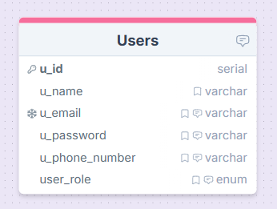
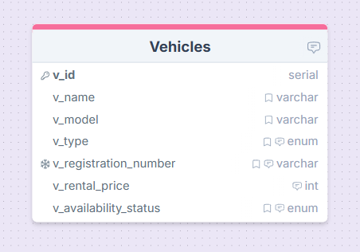
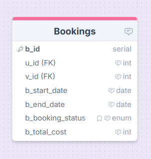
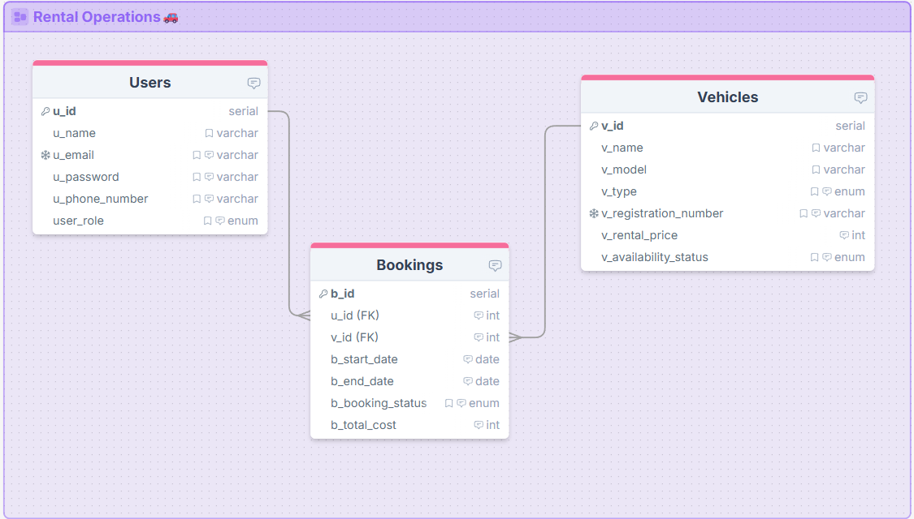
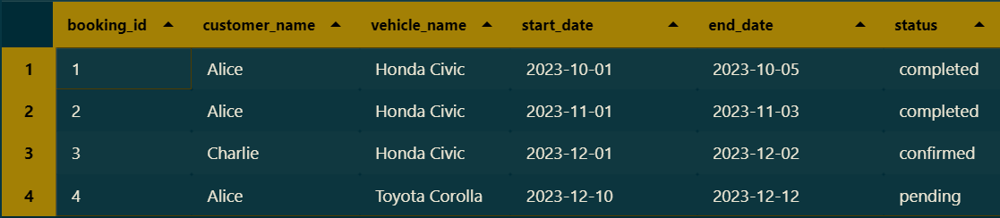
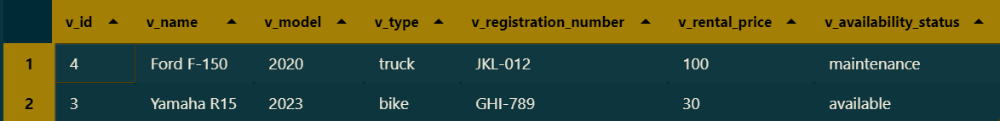

# 🚗 Vehicle Rental System — Database Project

## 📌 Overview & Objectives

This project evaluates the understanding of **relational database design**, **Entity-Relationship Diagrams (ERDs)**, and **SQL querying techniques**.  
The goal is to design and query a simplified **Vehicle Rental System** database that reflects real-world business logic and relationships.

---

## 🎯 Learning Outcomes

Upon successful completion of this project, you will be able to:

- Design ERDs with **1:1, 1:N, and N:1** relationships
- Understand and apply **primary key** and **foreign key** constraints
- Write SQL queries using:
  - `JOIN`
  - `EXISTS / NOT EXISTS`
  - `WHERE`
  - `GROUP BY` and `HAVING`

---

## 🗂️ Database Schema

The system consists of **three primary entities**:

---

### 👤 Users Table

| Column   | Type    | Constraints       |
| -------- | ------- | ----------------- |
| u_id     | INT     | Primary Key       |
| name     | VARCHAR | —                 |
| email    | VARCHAR | Unique            |
| password | VARCHAR | —                 |
| phone    | VARCHAR | —                 |
| role     | VARCHAR | Admin or Customer |

📷 **Table Structure**  

---

### 🚘 Vehicles Table

| Column          | Type    | Constraints                      |
| --------------- | ------- | -------------------------------- |
| v_id            | INT     | Primary Key                      |
| name            | VARCHAR | —                                |
| model           | VARCHAR | —                                |
| type            | VARCHAR | —                                |
| registration_no | VARCHAR | Unique                           |
| rental_price    | DECIMAL | —                                |
| status          | VARCHAR | Available / Rented / Maintenance |

📷 **Table Structure**  

---

### 📅 Bookings Table

| Column     | Type    | Constraints                                 |
| ---------- | ------- | ------------------------------------------- |
| b_id       | INT     | Primary Key                                 |
| u_id       | INT     | Foreign Key → Users(u_id)                   |
| v_id       | INT     | Foreign Key → Vehicles(v_id)                |
| start_date | DATE    | —                                           |
| end_date   | DATE    | —                                           |
| status     | VARCHAR | Pending / Confirmed / Completed / Cancelled |
| cost       | DECIMAL | —                                           |

📷 **Table Structure**  

---

## 🔗 Entity Relationships

| Relationship        | Cardinality                                      |
| ------------------- | ------------------------------------------------ |
| Users → Bookings    | 1:N (One user can make zero or many bookings)    |
| Vehicles → Bookings | 1:N (One vehicle can have zero or many bookings) |
| Bookings → Users    | N:1 (Many bookings belong to one user)           |
| Bookings → Vehicles | N:1 (Many bookings belong to one vehicle)        |

---

## 🛠️ Technical Stack

- **Database**: PostgreSQL
- **Database Tool**: Beekeeper Studio
- **ERD Tool**: DrawSQL

---

## 🧩 Full ERD Diagram (With Proper Relationships)

📷 **Complete ERD**  

🔗 **DrawSQL Link**  
👉 https://drawsql.app/teams/krypto-2/diagrams/vehicle-rental-system

---

## 🧪 SQL Queries

---

### 🔹 Query 1: JOIN

**Objective:**  
Retrieve booking information along with customer and vehicle details.

**Explanation:**  
This query uses `INNER JOIN` to combine data from the **bookings**, **users**, and **vehicles** tables.  
It retrieves meaningful booking information such as:

- Booking ID
- Customer name
- Vehicle name
- Booking start and end dates
- Booking status

📷 **Query Output**  

---

### 🔹 Query 2: NOT EXISTS

**Objective:**  
Find vehicles that have **never been booked**.

**Explanation:**  
This query identifies vehicles that do not appear in the **bookings** table.  
The `NOT EXISTS` clause checks, for each vehicle, whether a related booking record exists.  
If no booking is found, the vehicle is returned.

📷 **Query Output**  

---

### 🔹 Query 3: WHERE

**Objective:**  
Retrieve all **available vehicles of a specific type**.

**Explanation:**  
This query filters the **vehicles** table using the `WHERE` clause with multiple conditions:

- Vehicle type must be `'car'`
- Vehicle status must be `'available'`

📷 **Query Output**  

---

### 🔹 Query 4: GROUP BY with HAVING

**Objective:**  
Find vehicles with **more than two bookings**.

**Explanation:**  
This query groups booking records by vehicle and counts how many times each vehicle has been booked.  
The `HAVING` clause is used to filter aggregated results, returning only vehicles with more than **two bookings**.

📷 **Query Output**  

---

## 👨‍💻 Author

**Designed and implemented by**  
**Md. Masayeakh Islam**

🔗 **GitHub Profile**  
👉 https://github.com/mashayeakh
